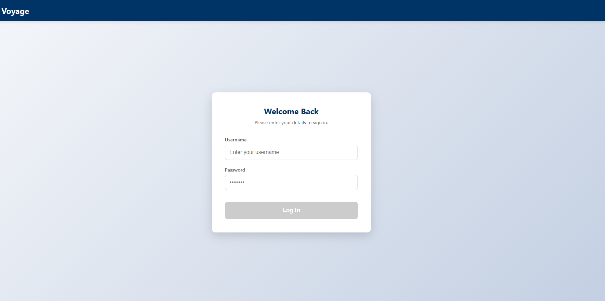
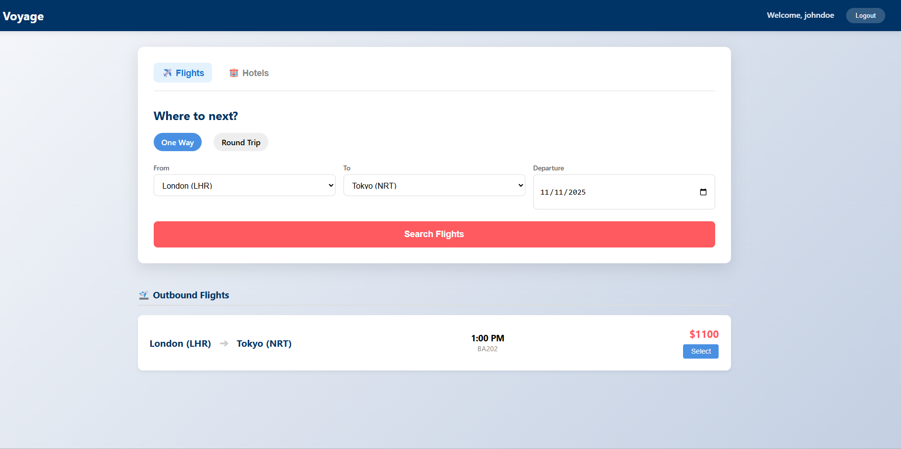
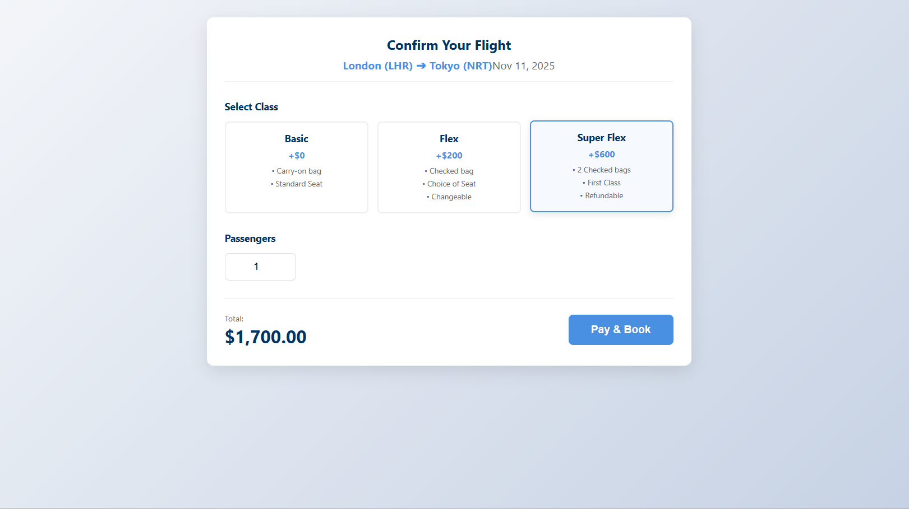
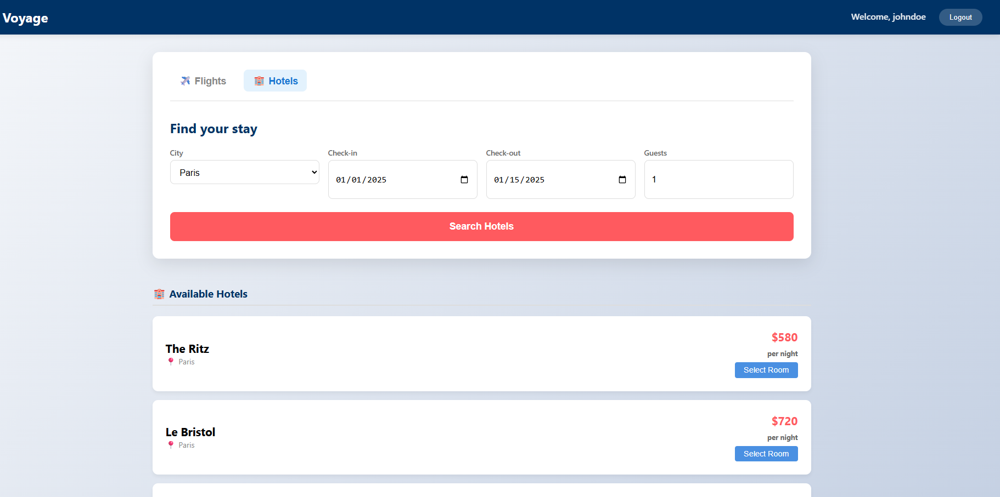
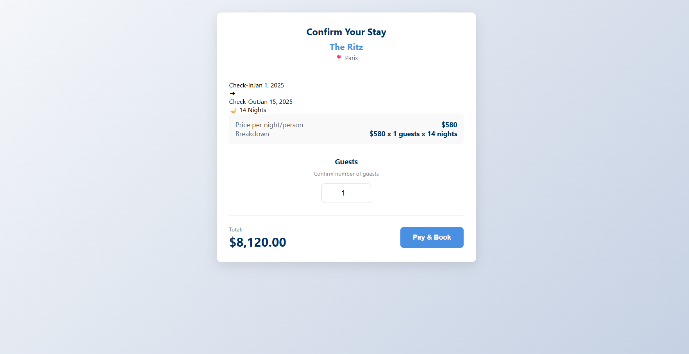

# Travel Reservation System (Microservices Architecture)

A robust, distributed travel booking platform built with **Spring Cloud Microservices** (Backend) and **Angular** (Frontend). This project demonstrates a production-ready architecture featuring centralized configuration, service discovery, distributed tracing, event-driven notifications, and resilience patterns.

## Project Overview

The goal of this project is to allow users to search for flights and hotels, create reservations, and process payments securely. The system is designed to be scalable and fault-tolerant, utilizing the "Database per Service" pattern and asynchronous communication for non-blocking operations.

### Key Features
* **User Authentication:** Secure login/registration using JWT.
* **Browsing:** Search for flights and hotels (publicly accessible).
* **Booking Orchestration:** Transactional booking process involving multiple services.
* **Payment Processing:** Simulation of payment gateways with success/failure scenarios.
* **Notifications:** Asynchronous email notifications upon booking confirmation using Kafka.
* **Resilience:** Circuit breakers to handle downstream service failures gracefully.

---

## Screenshots

* Login Page:

* Flights:

* Book Flight:

* Hotels:

* Book Hotel:


### Technology Stack

* **Backend:** Java 17+, Spring Boot 3.x
* **Frontend:** Angular 17+, Tailwind CSS
* **Cloud Native:** Spring Cloud (Gateway, Config, Netflix Eureka, OpenFeign, Resilience4J)
* **Messaging:** Apache Kafka, Zookeeper
* **Database:** PostgreSQL / MySQL (Database per service pattern)
* **Security:** Spring Security, OAuth2 Resource Server, JWT (HMAC-SHA256)
* **Build Tool:** Maven

---

## Microservices Breakdown

| Service Name | Port | Description |
| :--- | :--- | :--- |
| **Config Server** | `8888` | Centralized configuration for all services (backed by a Git repo). |
| **Eureka Server** | `8761` | Service Discovery & Registry (The "Phonebook"). |
| **API Gateway** | `9090` | Single entry point. Handles routing, security validation, and CORS. |
| **User Service** | `8081` | Manages users, roles, and issues JWT tokens (Authentication Server). |
| **Flight Service** | `8082` | Manages flight inventory and searching. |
| **Hotel Service** | `8083` | Manages hotel inventory and searching. |
| **Payment Service** | `8084` | Simulates payment processing (Random Success/Failure logic). |
| **Reservation Service** | `8085` | **The Orchestrator.** Coordinates Flight, Hotel, and Payment to create bookings. |
| **Notification Service** | `8086` | **The Subscriber.** Listens to Kafka topics to send emails asynchronously. |

---

## Security Implementation (JWT)

Security is implemented using a stateless **JWT (JSON Web Token)** architecture with a shared secret key (HMAC-SHA256).

1.  **Auth Flow:**
    * User logs in via `POST /api/auth/login` (routed to `user-service`).
    * `user-service` validates credentials against the DB (BCrypt hashed passwords) and issues a signed JWT.
2.  **Gateway Validation:**
    * The **API Gateway** acts as the primary firewall.
    * It intercepts every request, extracts the `Authorization: Bearer <token>` header, and validates the signature using the shared Hexadecimal secret key.
    * Invalid tokens are rejected with `401 Unauthorized` before reaching internal services.
3.  **Inter-Service Security (Zero Trust):**
    * Internal services (`flight-service`, `reservation-service`) act as **Resource Servers**.
    * They also validate the JWT token.
    * **Feign Interceptors** are used in the `reservation-service` to propagate the user's JWT from the incoming request to outgoing calls (to Flight/Hotel services), ensuring the user's identity persists across the transaction.

---

## Resilience & Fault Tolerance

The `reservation-service` relies on external services (Payment, Flight, Hotel). To prevent cascading failures, **Resilience4J** is implemented.

* **Circuit Breaker:** Applied specifically to the `PaymentClient`.
* **Behavior:** If the `payment-service` goes down or becomes slow (50% failure rate over 10 requests), the circuit "trips" (opens).
* **Fallback:** Subsequent requests are immediately redirected to a `fallback` method which returns a "Payment Service Unavailable" response, preventing the Reservation Service from hanging or crashing.

---

## How to Run

### Prerequisites
* Docker & Docker Compose (for Kafka/Zookeeper)
* Java JDK 17+
* Node.js & Angular CLI

### Steps
1.  **Start Infrastructure:**
    ```bash
    docker-compose up -d  # Starts Kafka and Zookeeper
    ```
2.  **Start Backend Services (In Order):**
    1.  `ConfigServerApplication`
    2.  `EurekaServerApplication`
    3.  `UserServiceApplication`, `FlightServiceApplication`, `HotelServiceApplication`, `PaymentServiceApplication`
    4.  `NotificationServiceApplication`
    5.  `ReservationServiceApplication`
    6.  **Finally:** `ApiGatewayApplication`
3.  **Start Frontend:**
    ```bash
    cd travel-client
    ng serve
    ```
4.  **Access:** Open `http://localhost:4200`

---

## Challenges & Solutions Report

During the development of this distributed system, several complex integration challenges were encountered and resolved:

### 1. The Gateway "Hollow Server" Issue
* **Problem:** The API Gateway was returning `404 Not Found` for all routes despite correct configuration.
* **Cause:** The dependency `spring-cloud-starter-gateway-server-webmvc` was included, forcing the Gateway to run on Tomcat (Servlet) instead of Netty (Reactive/WebFlux). This disabled the reactive routing engine.
* **Solution:** Switched to the correct `spring-cloud-starter-gateway` dependency to enable the reactive stack.

### 2. Feign Client Security Context Propagation
* **Problem:** `ReservationService` failed with `401 Unauthorized` when calling `FlightService`, even though the user was logged in.
* **Cause:** The JWT token validated at the Controller level was *not* automatically passed to the Feign Client for outgoing requests.
* **Solution:** Implemented a `RequestInterceptor` configuration to extract the `Authorization` header from the current `ServletRequest` and inject it into the Feign request template.

### 3. JWT Hex vs. Base64 Decoding
* **Problem:** `user-service` failed to start with `Illegal base64 character`.
* **Cause:** The secret key was a Hexadecimal string, but the `jjwt` library's `Decoders.BASE64` was used.
* **Solution:** Implemented a custom Hex decoder using `DatatypeConverter.parseHexBinary` to correctly interpret the secret key.

### 4. Kafka Serialization Errors
* **Problem:** The Notification Service crashed with `ClassNotFoundException` upon receiving a message.
* **Cause:** The producer (`reservation-service`) and consumer (`notification-service`) had slightly different package names configured in `application.properties` for the DTO deserializer (`_service` vs `service` typo).
* **Solution:** Standardized the fully qualified class names in the Kafka configuration across both services.

### 5. Resilience4J vs. Spring Cloud LoadBalancer
* **Problem:** The Circuit Breaker fallback was not triggering when the Payment Service was down; instead, a `RetryableException` was thrown.
* **Cause:** The Spring Cloud LoadBalancer's retry mechanism was catching the connection error *before* the Circuit Breaker could count it as a failure.
* **Solution:** Refactored the service to use the annotation-based `@CircuitBreaker` approach directly on the service method, wrapping the entire Feign execution flow.